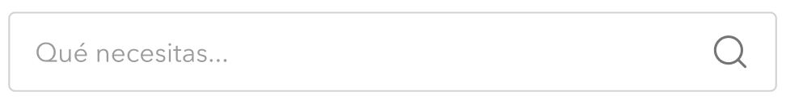

<div align="center">
  
  <h1>Vue Next Typeahead</h1>
</div>

> A simple component to display a __typeahead__ format with __Vue3__.

## Status

[](https://github.com/cristianpoleyJS/vue-next-typeahead/)
[](http://standardjs.com/)
[](https://github.com/cristianpoleyJS/vue-next-typeahead/)
[](https://github.com/cristianpoleyJS/vue-next-typeahead/)

## [Demo](https://codesandbox.io/s/interesting-kalam-5zkhh)

## Install

```bash
npm install vue-next-typeahead
```

## Quick start

### Globally

You can import in your `main.js` file

```js
import App from './App.vue'
import { createApp } from 'vue'
import VueNextTypeahead from 'vue-next-typeahead'

const app = createApp(App)
app.component(VueNextTypeahead)
```

### Locally in any component

```js
import VueNextTypeahead from 'vue-next-typeahead'

export default {
  components: {
    VueNextTypeahead
  }
};
```

## Basic usage

```html
<template>
    <VueNextTypeahead
      v-model:input="inputSearch"
      :api-url="`http://openlibrary.org/search.json${inputSearch ? `?title=${inputSearch}` : ''}`"
      :title="'Encuentra libros que te gusten'"
      :placeholder="'Busca un libro...'"
      :items="results"
      :key-item="'title'"
      :loading-parent-component="loading"
      @response="getResponse"
      @reset="resetComponent()"
      @hit="selectItem" />
</template>

<script>
  export default {
    data () {
        return {
            results: [],
            loading: false,
            inputSearch: '',
            itemSelected: {}
        }
    },
    methods: {
        async getResponse (responseJson) {
            this.loading = true
            const response = await responseJson.json()
            this.results = response.docs
            this.loading = false
        },

        selectItem (item) {
            this.itemSelected = item
        },

        resetComponent () {
            this.results = []
        }
    }
  };
</script>
```

## Props

| Property name       |    Type |  Default  |Description                                                                                    |
| ------------------------------ | ---------- | --------- | -------------------------------------------------------- |
| apiUrl                         |   String |        | URL to invoke the GET with fetch
| input                         |   String |    ''   | Default value of the input, used to make the data-binding.
| title                         |   String |   null    | Title that appears above the search input.
| className                         |   String |    ''   | Class to modify component styles.
| items                         |   Array |   []    | Items to be displayed in the results dropdown.
| keyItem                         |   String |   null    | Key to display the desired value of the array 'items'.
| showTitle                         |   Boolean |   true    | Displays or not the title of the input.
| placeholder                         |   String |   Qué necesitas...    | Placeholder for search input.
| noResultsText                         |   String |   No existen resultados para esa búsqueda...    | Text to be displayed when there are no results in the search.
| minChars                         |   Number |   2    | Minimum of values until you start searching, at least it should be 1.
| delay                         |   Number |   500    | Time in milliseconds for the timeout used in the typing of the input.
| loadingParentComponent                         |   Boolean |   true    | Used in case it is necessary to make synchronous operations in the main service response in the component.

## Emits
| Emit name       | Description |
| --------------- | ----------- |
| update:input | In the parent component, you can use v-model:input="var" so that 'var' is automatically updated when you write in the input. |
| response | First response returned by fetch GET. |
| hit | Event launched when you click on an option of the items that appears in the dropdown. |
| reset | When you reset all data within the component. |
| error | Error returned by the GET service. |

## Development

[](https://github.com/cristianpoleyJS/vue-next-typeahead/issues)

> **Note**: Contributions are very welcomed, however is very important to open a new issue using the issue template **before** you start working on anything, so we can discuss it before hand

Fork the project and enter this commands in your terminal

```sh
git clone https://github.com/cristianpoleyJS/vue-next-typeahead.git
cd vue-next-typeahead
npm install
npm run serve
```

### Commitlint

This project follows the [commitlint](https://github.com/conventional-changelog/commitlint) guidelines, with minor changes.

### TODO
- Unit testing with Jest.
- Web Component: Currently Vue3 does not support the generation of a Web Component, that's why I haven't generated it yet.

## License

MIT © [cristianpoleyJS](https://github.com/cristianpoleyJS/vue-next-typeahead/blob/master/LICENSE)
